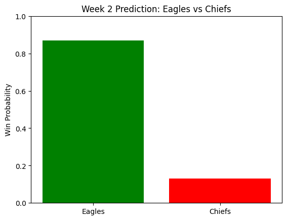

The NFL season is back! Each week, I’ll break down the Eagles’ performance and use data + machine learning to provide insights and predictions.

Week 1 Results:

The Eagles took down the Cowboys in the season opener in a thriller, winning 24-20. Offensively, the eagles were effective, putting up 302 total yards and were efficient on third downs. The Eagles defense initially struggled, but picked it up and made a crucial 4th down stop at the end of the game. 

Strengths: Strong rush game (158 total rushing yards), Good offensive line movement, Strong special teams unit
Weaknesses: Poor secondary, Passing game struggled slightly, Lack of pressure

Eagles had a very clear possession advantage (34:52 vs 25:08), meaning they had longer drives with more third down conversions, something crucial to take note of. 

This helped with their scoring margins and overall allowed them to take control and win this game. 

Week 2 predictions (vs Chiefs):

The Philadelphia Eagles face the Kansas City Chiefs in Week 2 of the NFL season. After a strong showing in Week 1, the Eagles look to continue their momentum, while the Chiefs aim to rebound from their opening game. This example uses historical and Week 1 stats to provide a data-driven prediction.

I used a logistic regression model trained on team performance metrics (yards, touchdowns, turnovers) from the 2025 superbowl and week 1 to predict the Eagles vs Chiefs outcome in week 2.  

Due to the lack of sufficient data, this probability is heavily skewed towards the Eagles, giving them almost a 90% win probability. Comparing the outcome of this game to this data is crucial for more accurate predictions in upcoming weeks for the Eagles. Let us more towards more analysis:

- **Eagles Edge in Offense**: The model favors Philadelphia due to high total yards and touchdown output in Week 1.  
- **Chiefs Challenge**: Kansas City’s defense allowed significant yards last week, contributing to a lower predicted win probability.  
- **Caveats**: With limited data, predictions are heavily influenced by week 1 performances. Probabilities will become more accurate as more games are played.

Take note of:

- Jalen Hurts vs Patrick Mahomes performance under pressure  
- Turnover margin: Which side will cough the ball up more
- Red zone efficiency: How will both teams convert long drives into 6 points
- Unexpected injuries that can totally shift the outcome of the game

That's all for this week. Stay tuned!
